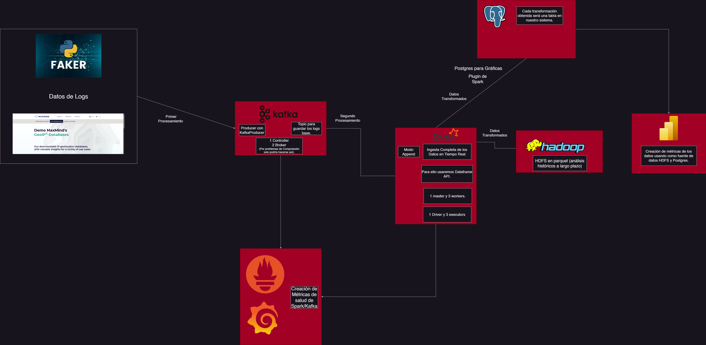
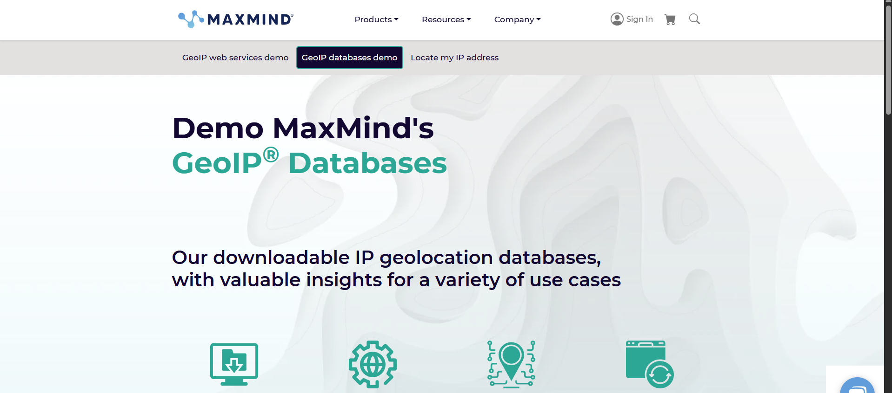
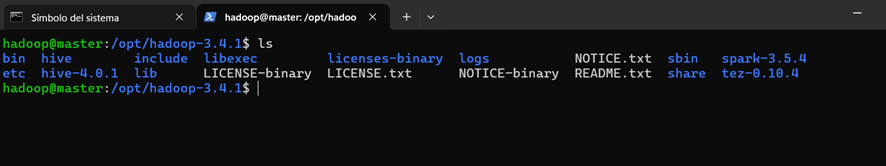
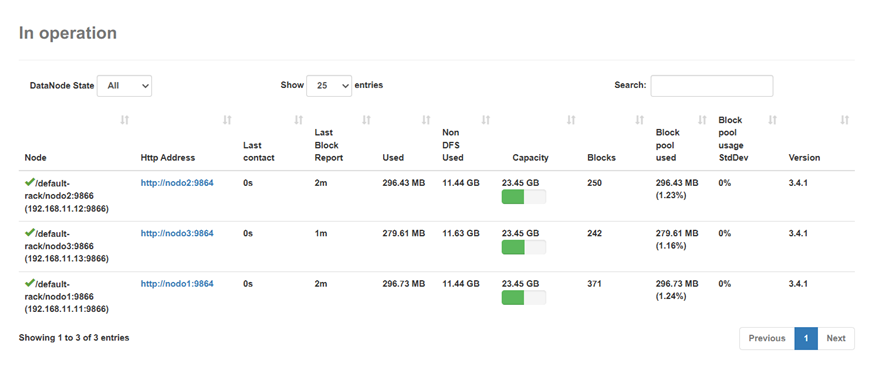
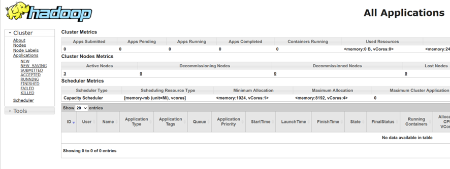
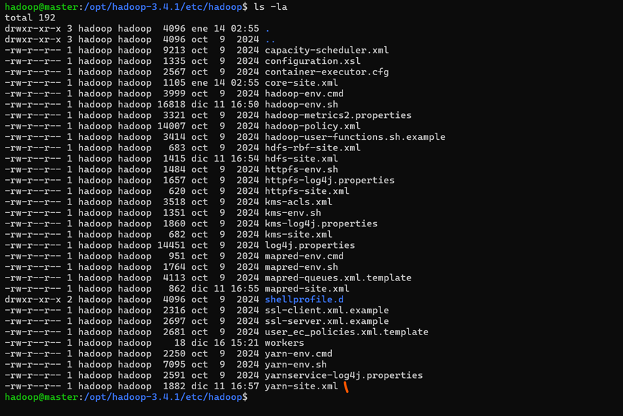
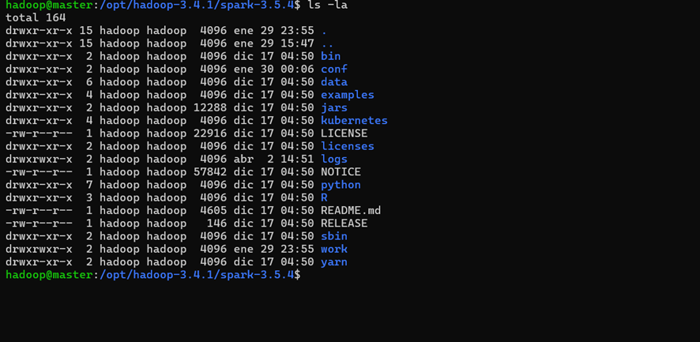
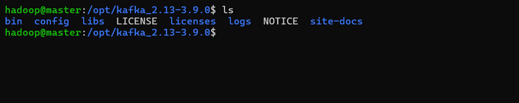
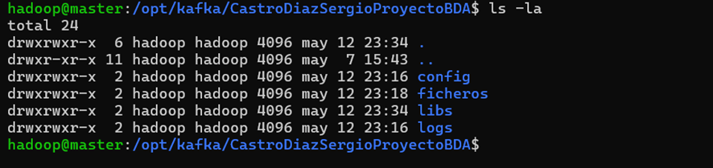
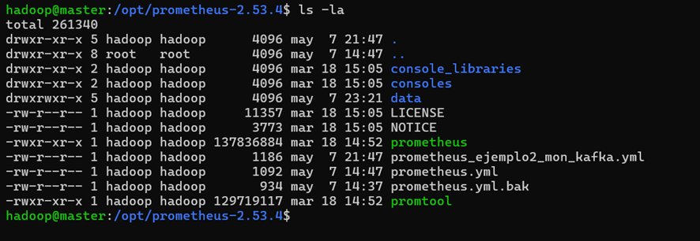

# Big Data Aplicado - Castro Díaz Sergio
## Proyecto Final - Análisis de Logs HTTP enfocados a la Seguridad y al Marketing.

## Índice

- [Requisitos](#Requisitos)
- [Objetivo del Proyecto](#OBJETIVO)
- [Descripción](#Descripción)
- [Business Intelligence](#business-intelligence)
- [Esquema Técnico](#esquema-técnico)
   - [Generación Logs](#generación-logs)
   - [Kafka](#kafka)
   - [Spark Streaming](#spark-streaming)
   - [Extracción de Métricas con Prometheus y Visualización con Grafana](#extracción-de-métricas-con-prometheus-y-visualización-con-grafana)
   - [Load en HDFS y PostgreSQL](#load-en-hdfs-y-postgresql)
   - [Gráficas Con Power BI](#gráficas-con-power-bi)
- [Configuración del Clúster](#configuración-del-clúster)
   - [Hadoop](#hadoop)
   - [MapReduce](#mapreduce)
   - [Yarn](#yarn)
   - [Spark](#spark)
   - [Kafka](#kafka)
   - [Directorio de nuestro Proyecto](#directorio-de-nuestro-proyecto)
   - [Grafana y Prometheus](#grafana-y-prometheus)
   - [PostgreSQL](#postgresql)
   - [Power BI](#power-bi)
- [Desarrollo del Proyecto](#desarrollo-del-proyecto)
   - [Información de los Datos](#información-de-los-datos)
   - [Estructura de los Datos](#estructura-de-los-datos)
   - [Ejecución del Proyecto](#ejecución-del-proyecto)
        - [Producer de Kafka](#producer-de-kafka)
        - [Consumer de Spark Streaming](#consumer-de-spark-streaming)
        - [Configuración del Controller de Kafka](#configuración-del-controller-de-kafka)
        - [Configuración del broker1](#configuración-del-broker1)
        - [Configuración del broker2](#configuración-del-broker2)
        - [Configuración de Prometheus](#configuración-de-prometheus)
        - [Métricas de Spark en Prometheus](#métricas-de-spark-en-prometheus)
        - [Configuración de PostgreSQL](#configuración-de-postgresql)
        - [Configuración Power BI](#configuración-power-bi)
        - [Configuración HDFS en Power BI](#configuración-hdfs-en-power-bi)
   - [Despliegue del Proyecto](#despliegue-del-proyecto)
     - [Levantar Hadoop](#levantar-hadoop)
     - [Levantar Spark](#levantar-spark)
     - [Levantar Kafka](#levantar-kafka)
     - [Ejecución de Prometheus y Grafana](#ejecución-de-prometheus-y-grafana)
     - [Ejecución del Producer de Kafka](#ejecución-del-producer-de-kafka)
     - [Ejecución del Consumer de los datos a través de Spark Streaming](#ejecución-del-consumer-de-los-datos-a-través-de-spark-streaming)
     - [Visualización en Power BI](#visualización-en-power-bi)
       - [Tráfico General](#tráfico-general)
       - [Contajes y Otras métricas de Tráfico](#contajes-y-otras-métricas-de-tráfico)
       - [Contaje de Errores por Codigos de Respuesta y user_agents](#contaje-de-errores-por-codigos-de-respuesta-y-user_agents)
       - [Tamaños de Respuesta](#tamaños-de-respuesta)
       - [Bots](#bots)
       - [Geolocalización](#geolocalización)
       - [Ataques por Hora](#ataques-por-hora)
       - [Otras Métricas](otras-métricas)
    - [Visualización Usando HDFS](#visualización-usando-hdfs)
    - [Diferencias entre Postgre y HDFS en Power BI](#diferencias-entre-postgre-y-hdfs-en-power-bi)
    - [Conclusiones](#conclusiones)
- [Webgrafía](#webgrafía)
- [Licencia](#licencia)


# Requisitos

1. El proyecto deberá tener todo el stack de todos los sistemas vistos en clase perfectamente instalado, configurado y funcionando como un Sistema completo de Big Data, desde la ingesta de datos, ETL, BI y su visualización.
2. El alumnado elegirá el origen, los tipos y la temática de los datos que se van a procesar en el Sistema Big Data.
3. Deben establecer, desarrollar y justificar el tipo de conocimiento que van a obtener de los datos origen después de su ingesta y procesamiento (ETL) en el sistema. 
4. El procesamiento de los datos lo realizarán a través de SPARK, utilizando alguna de sus 3 APIs disponibles. Esto no quita que puedan realizar algún tipo de procesamiento de datos anteriormente, como por ejemplo en Kafka.
5. El sistema debe poder soportar la ingesta de datos tanto en batch como en streaming.
6. Los datos de origen podrán ser sintéticos, reales o una combinación de ambos.
7. Puedes usar las Api/s que creas necesaria/s. Incluso la creación de tus propios datos sintéticos en batch y streaming (Estos deben cumplir con los requisitos del puntos 1 al 3)
8. Todo el ETL realizado deberá estar correctamente desarrollado y justificado.
9. Se deberá añadir al stack algún sistema, servicio, ... de investigación propia (al menos 1, aunque puede añadir todos los que quieras). Se propone una lista de ellos, que podrán ser ampliados a propuesta del alumnado:
   1. AWS GLUE
   2. AWS S3
   3. Nifi
   4. Flink
   5. Tableau
   6. PowerBI
   7. Elasticsearch
   8. Kibana
   9.  RabbitMQ
   10. Otros (deben ser consensuados y aprobados)

## Requisitos comunes

1. El sistema completo será, como mínimo (más la investigación propia):
   1. Apache Hadoop Common
   2. HDFS
   3. MapReduce
   4. Yarn
   5. Spark
   6. Kafka
   7. Grafana
2. Debe haber como mínimo 3 nodos en los clusters (en cada uno):
   1. Hadoop (HDFS/Yarn)
   2. Spark
   3. Kafka
3. Añade todos los nodos que necesites para desplegar todo el stack Big Data del proyecto.
4. Deben soportar acceso concurrente desde varios nodos Edge.


1. A mayor y mejor ETL y mayor y mejor Business Intelligence, mejor calificación.
2. Si un proyecto no tiene suficiente procesamiento de datos y obtención de conocimiento, mayor será la exigencia de la investigación propia o viceversa. 


## Objetivo


Un estudio sobre cómo funciona y pasa el tráfico general HTTP/s de la empresa de marketing a cada paso y con ello intentar extraer resultados interesantes y estadística general para mejorar sus estrategias de publicidad/marketing y distribución de servicios además de posibles amenazas o intentos de ataques de conexión que podrían arruinar su trabajo.

## Descripción

Vamos a realizar la investigación de los logs en este caso provenientes de los protocolos HTTP/s (servidor Apache o Nginx entre otros) ya que son dos de los protocolos más usados por las empresas en general, aunque es interesante destacar que el proyecto o trabajo es ampliable a otro tipo de logs y llegada de mensajes como son logs SQL o bien logs del sistema operativo en sí.

Esto se realizará en tiempo real o streaming, en este caso conexiones cada 1 segundo que es perfecto para un escenario de Big Data, ya que además necesitamos un registro a largo plazo de cada conexión realizada ya que la pérdida de una sola conexión podría implicar que no se pudiera realizar por ejemplo un análisis forense completo etc. Todo estos logs se preprocesarán mediante Kafka usando sus componentes Controller y Brokers.

Para realizar la ingesta, hemos creado un programa mediante Faker que simula la carga de los logs (datos sintéticos) con los campos básicos que nos proporciona un servidor Apache en sus logs de acceso (access.log) + información extra como es la localización de cada conexión de ataque (ya sea IP real o proxy/VPN) que nos permitirá estudiar la distribución anteriormente dicha.

Esta geolocalización se realizará en Spark Streaming mediante el proceso ETL al igual que otros cálculos.

Para ingerir los datos hemos usado la API de Dataframe de Spark Streaming lo que nos permitirá aprovechar todas las capacidades del tiempo real de nuestros logs.

La parte final es la visualización donde hemos usado una serie de herramientas:

- Prometheus: Nos permite recoger métricas para controlar y monitorear la salud de nuestras aplicaciones Kafka y Spark.

- Grafana: Nos permite realizar las gráficas sobre estás métricas extraidas por Prometheus, también serviría para extraer las métricas de nuestros datos pero es más complejo realizar.

- Power BI Desktop: Con esta herramienta de Windows, realizaremos todas las gráficas de nuestras métricas, a partir del ETL realizamos nuestras métricas.

## Business Intelligence

## 📊 Análisis de Logs Web

### 1. Tráfico y Comportamiento

- **¿Qué IPs generan más tráfico?**  
  Identificar las direcciones IP que generan mayor cantidad de solicitudes al servidor.

- **¿Cuáles son las horas pico de tráfico?**  
  Determinar en qué franjas horarias se concentra el mayor volumen de tráfico web.

- **¿Qué países o ciudades generan más solicitudes?**  
  Analizar la distribución geográfica de las solicitudes entrantes para localizar zonas de mayor actividad.

- **¿Cuáles son las páginas o URIs más accedidas?**  
  Obtener un ranking de las rutas del sitio más visitadas por los usuarios.

- **¿Qué métodos HTTP se usan con mayor frecuencia?**  
  Ver la proporción de métodos como `GET`, `POST`, `PUT`, `DELETE`, etc., utilizados en las solicitudes.

---

### 2. Errores y Rendimiento

- **¿Qué porcentaje de las solicitudes produce errores (4xx o 5xx)?**  
  Calcular la proporción de respuestas con errores respecto al total de tráfico.

- **¿Qué países tienen la tasa de error más alta?**  
  Localizar qué regiones geográficas presentan más problemas al interactuar con el sistema.

- **¿Qué agentes de usuario están asociados a los errores?**  
  Detectar navegadores o bots que generan más respuestas erróneas.

- **¿En qué franjas horarias ocurren más errores?**  
  Identificar momentos del día donde se concentran las fallas o errores.

---

### 3. Geolocalización y Seguridad

- **¿Dónde geográficamente se concentran los intentos de acceso malicioso (login, admin, etc.)?**  
  Mapear zonas desde las cuales se realizan accesos sospechosos a rutas críticas.

- **¿Desde qué países o IPs provienen más intentos de ataque?**  
  Detectar focos de posibles ataques o comportamientos automatizados.

- **¿Qué patrones de geolocalización muestran comportamientos sospechosos?**  
  Analizar comportamientos anómalos por localización que pueden sugerir bots, fraude o scraping.

---

### 4. Bots y Crawlers

- **¿Qué porcentaje del tráfico proviene de bots?**  
  Estimar cuánta parte del tráfico es generado por bots conocidos o sospechosos.

- **¿Cuáles son los bots más activos?**  
  Identificar bots por agente de usuario o IP que más interactúan con la web.

- **¿Están los bots generando errores o accediendo a zonas sensibles?**  
  Ver si los bots están accediendo a páginas protegidas o generando peticiones inválidas.

---

### 5. Tamaño de Respuesta

- **¿Cuál es el tamaño promedio de los contenidos servidos por país o código de estado?**  
  Analizar la cantidad de datos servidos por país o en función de si la respuesta fue exitosa o fallida.

- **¿Hay alguna relación entre el tamaño de los contenidos y los errores?**  
  Evaluar si las respuestas con errores tienden a tener un tamaño atípico o si hay correlación entre carga de datos y fallos.


Con esto podemos obtener conocimiento sobre diversas áreas:
-	Seguridad Informática: IPs que generan ataques, origen geográfico, URIs atacadas.
-	Operacional: Horas pico, ciudades/países con más tráfico.
-	Marketing: Países/ciudades con más uso, bots que indexan el sitio.
-	UX y Desarrollo de Interfaces: URIs más accedidas, errores comunes, navegadores usados.
-	Análisis Forense: Reconstrucción de ataques, tráfico anómalo, patrones sospechosos.

Este proyecto finalmente como resultado hará que las empresas puedan salvar datos, dinero y reputación así como aumentar las ganancias.


## Esquema Técnico



Podemos dividir las fases realizadas:

### Generación Logs




- Generación de Logs: Como estamos en un entorno de pruebas, para realizar un sistema similar al que tendríamos en la vida real, necesitamos obtener los datos de algún sitio, para ello usaremos una librería creada en python llamada **Faker** que permite generar datos sintéticos en general usando sintaxis creada. Estos logs generados tendrán una estructura similar a Apache + datos de geolocalización. Estos datos se enviarán a Kafka para preprocesarlos a través de un topic que escuchará en uno de los broker.

¿De Donde Proceden estos datos de Geolocalización?: Tras una investigación se ha logrado encontrar una librería llamada **Geo2IP** que se enfoca en la investigación de obtener IP, Países, Ciudades reales (incluso de direcciones fakes) basándonose al igual en Python para hacerlo, esto permite generar datos sintéticos bastante reales basándose en lo que podríamos encontrar en la realidad.

### Kafka


Realizamos un primer preprocesamiento usando la herramienta de Kafka donde usando un controller (permite gestionanr el estado del clúster, en KRaft además gestionar el quorum y los metadatos) y 2 broker (nodos que almacenan y sirven los datos o mensajes de Kafka a los productores y consumidores).

Aquí también crearemos el Topic con 2 réplicas y 2 particiones (lo crearemos con 2 réplicas ya que usamos 2 broker, si tuvieramos más podríamos añadir más réplicas).

El Producer además contiene la librería Kafka-Python que es la que permite realizar todo el proceso con Python.

En este proyecto no se utilizará Kafka Connect ya que la fuente es un producer como tal y no JSON, SQL o una base de datos externa por lo que no necesitamos Connect que es un modulo enfocado para eso (por lo tanto no necesitamos workers).

### Spark Streaming


Una vez preprocesados los datos mediante Kafka y su paso al topic, mediante **Spark Streaming y la API de Dataframe** realizaremos el segundo procesamiento usando un consumer de Spark, en este caso la parte más importante: Fase ETL (Extract, Transform y Load) donde realizamos la extracción en este caso del topic de Kafka, realizar una serie de transformaciones usando la API y finalmente la Carga donde lo enviamos a HDFS para análisis históricos a largo plazo y en mi caso tras una investigación a una base de datos: PostgresSQL ya que esta con la configuración correcta en Power Bi Desktop permite realizar las gráficas y luego añadir la visualización a tiempo real.

El modo de entregar los mensajes será usando el Exactly-Once que garantiza que todos los mensajes se entregarán una vez así como el formato de guardado en HDFS será Parquet (similar a CSV pero más enfocado a tiempo real), en Postgres serán tablas que después crearemos así como el modo **append** (añade los registros y no sobreescribe lo que es útil en análisis históricos de los logs).

La arquitectura de Spark contendrá:
- 1 nodo master (máquina master en la 192.168.60.10 (tarjeta externa) y 192.168.11.10 (comunicacion interna) respectivamente)
- 1 Worker (192.168.11.11) - nodo1
- 1 Worker (192.168.11.12) - nodo2
- 1 Worker (192.168.11.13) - nodo3

Estos correrán en el modo Standalone (cluster manager ya incluido con Spark).

Esto es ampliable a más según los requisitos del proyecto.

También destacar la presencia del componente: 

- Driver (Averigua las máquinas que ejecutan la lógica de la aplicación, para cada una de los 3 nodos, el driver realiza una petición para lanzar un proceso conocido como Executor y que gestiona y distribuye sus tareas). El driver normalmente es la propia máquina donde se ejecuta el programa (master en nuestro caso).

## Extracción de Métricas con Prometheus y Visualización con Grafana


Usando el software de Prometheus podemos extraer las métricas de salud de los dos software configurados anteriormente (a métricas de salud nos referimos por ejemplo a monitorizar el número de brokers para Kafka y su uso o bien en Spark el numero de workers activos y cuantos recursos del sistema usan), para ello con una configuración de Prometheus correcta (después la veremos) pues podemos realizar esta obtención.

Para Kafka será nececesario una configuración JMX Exporter (basada en Java) que permite monitorizar las aplicación.

Por su parte para Spark, desde la versión 3.5 viene un método que es nativo y que configuraremos en la guía de ejecución del proyecto. **(Investigación Propia)**

Grafana por su parte nos permitirá crear las gráficas de las métricas extraidas por Prometheus. Es similar a Power Bi pero de código abierto y con más disponibilidad de conexiones.

## Load en HDFS y PostgreSQL


En esta parte, guardamos los datos tanto en nuestro sistema HDFS como en una base de datos PostgreSQL usando una serie de métodos:

- Para obtener los datos usamos el driver por defecto de Kafka que ya viene instalado desde la 3.5.2

- Para HDFS, Spark se integra con HDFS mediante las bibliotecas de Hadoop que están disponibles en el classpath de Spark.

- Para Postgres usaremos el driver JAR (JDBC) 4.2.7.5 preparado para Java 8 (nuestra versión de Java instalada) y lo moveremos al directorio lib de Spark y luego lo definiremos en el spark-submit. Lo descargamos y lo configuraremos después.

En HDFS tendremos una arquitectura basada en el propio sistema Hadoop + Yarn (gestor de recursos y ejecutor de aplicaciones MapReduce). Esto será distribuido en:

- 1 nodo master: Encargado de los procesos de gestión global, es decir, controlar la ejecución o el almacenamiento de los trabajos y/o datos. Son los nodos que controlan el trabajo que realizan los nodos worker.

- 3 nodos worker: Realizan los trabajos. Tratan con los datos locales y los procesos de la aplicación. Por ejemplo, para el almacenamiento, cada worker se ocupará de almacenar una parte, mientras que, para la ejecución de trabajos, cada worker realiza una parte del trabajo.

Dentro de la arquitectura general tendremos un:
-	Namenode: Almacena toda la metainformación como el nombre de los espacios de nombres y la estructura de los ficheros e información de cada dato, también coordina las lecturas y escrituras y controla a los DataNodes.

-	DataNodes: Cada nodo worker es uno o varios DataNode (ya que un Namenode puede tener varios) y estos almacenan y leen los bloques que componen los ficheros dentro de HDFS, estos almacenan además checksum para detectar bloques corruptos, útil para averiguar problemas.

## Gráficas con Power BI


La última parte consistirá en crear una serie de gráficas basadas en el ETL que nos brindará la información del marketing, publicidad y seguridad que nos van llegando para saber como tenemos que mejorar la arquitectura empresarial.


## Configuración del Clúster

### Hadoop

Estas máquinas representan 1 a un nodo master de Hadoop (NameNode) y las otras 3 a nodos worker de Hadoop que serán DataNodes que almacenarán y leerán los bloques de Hadoop y HDFS.



En nuestro caso lo haremos con la versión 3.4.1.

Para acceder de forma sencilla usamos la dirección IP y el puerto de la interfaz GUI:

```
http://192.168.60.10:9870
```



### MapReduce



No se ha realizado ninguna prueba pero se accede para ver la carga de las aplicaciones a través de

Para acceder usamos la IP y el puerto 8088.

```
http://192.168.60.10:8088/cluster/nodes 
```

### Yarn



Vemos que lo tenemos instalado.

### Spark

Dentro del mismo master necesitamos ejecutar mínimo un nodo worker de Spark para que podamos ejecutar la aplicación que haremos con el ETL de nuestros datos usando spark-submit. Este spark-submit contendrá los dos paquetes necesarios:
-	Kakfa: Visto en el tema, útil para recoger los datos que son preprocesados por Kafka.
-	PostgreSQL: Necesitamos el JDBC jar de dicho servicio para poder hacer sink o guardado de los datos dentro de la BD. Dicho JDBC driver va dentro de jars. **(Investigación Propia)**

Dicho conector lo descargamos de la web de PostgreSQL (link en la Webgrafía). 



Vemos que está instalado correctamente.

### Kafka



En Kafka (dejaremos la 3.9) perdiendo la disponibilidad de los qorum dinámicos de la 4.0 (quitar o poner nodos en caliente), configuraremos en el nodo master 1 controller y 2 broker ya que por problemas de rendimiento no podemos levantar más, además crearemos 1 topic (replica 2 ya que tenemos 2 broker) y 2 particiones para guardar los datos. 

No hará falta conectores externos por lo tanto no necesitamos Kafka Connect (ya mencionado anteriormente) porque la fuente es un fichero generador que lo manda directamente como un producer de Kafka y lo guarda los datos en un topic de Kafka.

La conexión entre Kafka y Spark se realizará usando un plugin por defecto en específico: spark-sql-kafka-0-10_2.12:3.5.4 (última versión del plugin de conexión).

### Directorio de nuestro Proyecto



Visualizando el directorio de nuestro proyecto podemos ver los directorios

-	Config: Directorio de las configuraciones de los controller y brokers de Kafka.
-	Ficheros: Nuestros ficheros de generación de los datos mediante un producer de Kafka y un consumer de Spark que irá consumiendo los datos del topic y realizando el ETL así como las BD de países y ciudades.
-	Libs: Directorio para conectores.
-	Logs de cada componente de Config que se formatearán cada vez que hagamos un uso del mismo. No se pasa al repositorio ya que los logs en cada ejecución son eliminados (entorno de pruebas).

### Grafana y Prometheus



Podemos ver una instalación de Prometheus donde usaremos una configuración preparada para el cluster de Kafka que ya poseemos donde podemos hacer métricas pero especialmente usaremos la que podemos ver métricas para brokers, workers y el controller. (fichero ejemplo2_mon_kafka.yml).


No funciona porque no hemos cargado nada, ya que lo haremos todo dentro de la realización del proyecto, este punto es para mostrar que tenemos Grafana y Prometheus instalado y configurado para coger las métricas de Prometheus. 

### PostgreSQL

Configuraremos postgres usando una instalación en el repositorio de Ubuntu directamente usando comandos de instalación.


Instalamos el servidor postgres.

### Power BI


Aquí simplemente es tener el Power BI Desktop para Windows

## Desarrollo del Proyecto

Partiremos de que se ha realizado ya la configuración de la instalación (no de brokers, workers etc) correspondiente para el stack completo. También configuraremos PostgreSQL, Power BI y Prometheus para extraer las métricas de Prometheus.

### Información de los Datos

Nuestra empresa tiene permitida la realización de la monitorización del tráfico de logs de acceso (access.log) de la empresa de marketing permitiendo y autorizando la llegada de direcciones IP, en principio de clientes que se conectan para usar los distintos servicios que ofrecen como por ejemplo la tienda de Wordpress montada, incluidos otro tipo de datos como son los tipos de petición o si fueran válidas etc. Estos datos son gracias a la monitorización de los servidores Apache/Nginx que nos devuelve este tipo de información.

### Estructura de los Datos


Los datos extraidos a través de la auditoría a los protocolos HTTP/s (servicios Apache o Nginx) son:

- ip: La IP de la conexión, esta es basada en un ISP usando la base de datos GEO2IP, donde sin embargo aun no reconocemos a que país, ciudad pertenece ya que eso se realizara en el proceso de Transformación del ETL.
- timestamp: Fecha de llegada del evento, en este caso llegará un log por segundo ya que queremos capturar los mismos y no podemos perder registros. Este puede ser útil para consultas para window y watermarking que en este caso no se han realizado por falta de tiempo.
- timezone: Zona horaria, en un posible escenario real, la zona horaria podría ser interesante para realizar algún tipo de métrica o ver la distribución por la misma.
- method: Método usado para la conexión, siendo lectura GET o interactividad con POST, PUT y DELETE.
- uri: Sección de la URL a la que se ha intentado realizar la conexión.
- http_version: Versión del protocolo HTTP usada.
- response_code: Código de respuesta, significando 200 (OK), 300 (multiples respuestas y el user_agent decide una), 400 (error de cliente) y 500 (error del servidor).
- bytes: Numero de bytes de la petición.
- referer: Dirección Web donde está alojado el recurso solicitado en el uri.
- user_agent: Agente de usuario que se ha utilizado para la conexión.

Con todos estos datos base y puros que nos proporciona el servicio Apache podemos obtener bastante conocimiento mediante el ETL.

### Ejecución del Proyecto

Dentro del directorio de ficheros tenemos nuestro producer de Kafka y nuestro programa consumer de Spark Streaming que realiza el ETL correspondiente.


Los otros dos ficheros son las bases de datos proporcionados por GeoIP2 que representan direcciones IP públicas, países y ciudades de ISP y organismos oficiales, una forma realmente rápida de obtener direcciones reales sin necesidad de una API como tal ya que con tan solo la librería llamado geoip2 y los dos ficheros y luego la definición en el código es suficiente.

#### Producer de Kafka

El programa como tal genera los datos sintéticos basados en los logs de Apache reales usando la libería Faker, estos datos representan una lista de logs, siendo un log por segundo. 

Con una variable en la función main, se genera un flujo en streaming mediante el cual se envían estos datos a Kafka, registrando cada mensaje y esperando un segundo antes de repetir el proceso.


Esta variable NUM_LOGS aumenta con cada segundo que pasa en 1.


Dentro del código es interesante destacar el uso de algoritmos para definir una cierta aleatoridad en las conexiones generadas que simulan posibles anomalías además de hacer que las IP sean las buscadas por la database de GeoIP2.


La salida por consola será un log de Apache en formato JSON, en esta parte del código añadimos la aleatoridad en algunos campos

Como datos finales obtendremos estas columnas. 


#### Consumer de Spark Streaming

Dentro de este programa se implementa un sistema streaming en tiempo real, de nuestros datos ya preprocesados con Kafka (los lee del topic) y procesa los datos otra vez realizando las respectivas transformaciones ETL.

- Una de las transformaciones incluye la obtención de la ciudad,país, latitud y longitud de las IPs ya que las IP no tienen sentido geográfico sin añadir el enriquecimiento, para ello usando dicha DB de ciudades y países, nos proporcionará esta información adicional. Para ello ya que Spark necesita de los workers subiremos los ficheros a nuestro sistema HDFS y luego instalamos la librería en todas las máquinas o nodos (incluidos el master).


```
pip install geoip2
```


- Definiremos la estructura para nuestros datos, esto facilita el parsing eficiente y validado de logs que contienen información clave como IP, método HTTP, código de respuesta, etc.


- Definiremos los cálculos para las ubicaciones de las IP mediante una función UDF (Investigación Propia), estas funciones son llamadas Funciones de Usuario y son funciones avanzadas que no vienen por defecto en PySpark. Este cálculo es mucho mejor realizarlo con este tipo de función porque hay que recalcular siempre cada IP y eso con funciones comunes puede no funcionar o bien que el sistema vaya peor de rendimiento.


- Definimos los nuevos StructFields de cada uno de los campos de la localización.


- Leemos desde el topic ya creado en Kafka, cabe destacar que como no queremos perder datos de logs ejecutamos desde el último que se genere siempre (startingOffsets latest) y si cortamos por lo que sea el sistema Streaming al estar en un entorno de pruebas podemos usar la option failOnDataLoss que permite que aunque algunos offsets se pierdan pueda continuar, esto podría hacer que en un entorno real pudiesemos perder datos pero al estar en pruebas no afecta mucho.


Dentro del dataframe realizamos algunas transformaciones ligeras para castear los logs del formato JSON de Kafka y obtener las columnas de la geolocalización de cada IP así como algunas de errores u hora a partir del timestamp ya que esta permitirá realizar alguna métrica basada en el procesamiento de logs por horas (a falta de poder simular meses u años).

Algunas de estas transformaciones incluyen:

- .withColumn("location_info", resolve_ip_location(...)): Nos permite enriquecer con país y ciudades lo que ayuda a distinguir entre paises sospechosos y los que no son además de realizar la segmentación a futuro.

- .withColumn("event_time", to_timestamp("timestamp")): Normalizamos el formato de tiempo, esto para simplificar el análisis por horas o por días (dependiendo del contexto).

- .withColumn("response_code_category", substring(...)): Agrupamos por categoría de código (2xx, 4xx, 5xx), lo cual facilita las métricas que usen esta información y englobamos mejor.

- .withColumn("is_error", when(...)): Marca si fue un error, util para detectar los fallos y señalarlos a la hora de calcular métricas.

- .withColumn("uri_lower", lower(...)): Uniformamos las uris conviertiéndolas a minusculas para limpiar posibles formatos erróneos y mejorar las métricas relacionadas con esto.


También realizaremos algunos cálculos sobre las columnas obtenidas que nos permitirá obtener los datos para nuestro ETL, esto es bastante customizable y se pueden añadir métricas inclusive que lleven window/watermarking entre otras. Estas métricas se guardan por cada micro-batch de Spark Streaming. 


Finalmente guardamos los datos de HDFS en parquet y cada métrica en una tabla de PostgreSQL y guardamos los checkpoint en el directorio de HDFS, esto evitando mejorando la eficiencia en el reinicio del NameNode y sobre todo la corrupción de los datos si se corta el sistema por lo que sea.

Guardamos en HDFS > Análisis Históricos y crear Machine Learning a futuro (para la segmentación).

Guardamos en Postgres > Visualización de nuestros dashboards.

#### Configuración del Controller de Kafka

Dentro del directorio config tenemos nuestros ficheros de configuración


Aquí la única configuración que debemos tocar es hacer que los logs se guarden en un directorio dentro de logs pero de nuestro proyecto.


Otras configuraciones incluyen:


Asignamos el id del nodo 1 para identificarlo, además al estar en 3.9 seguimos usando los qorum estáticos mediante los voters escuchando en el 9093, asignamos todos los listeners en dicho puerto.

#### Configuración del broker1

En nuestro caso como hemos explicado por falta de recursos usaremos dos broker únicamente donde la configuración será la siguiente:


Es importante que cada broker tenga un identificador distinto al del controller (que es el 1, por lo que en este caso le ponemos al 2 y así sucesivamente al añadir brokers.

Es importante que el quorum sea el mismo del controller, en algunas configuraciones se hace con bootstrap pero como estamos con los qorum estáticos podemos dejarlo en localhost pero si es importante que si queremos hacer que consuma los datos en streaming de Spark pongamos la IP en vez de localhost en los listeners por cuestiones de seguridad.


También es importante que los logs se guarden de igual forma que el controller dentro de su respectivo directorio.

#### Configuración del broker2

Configuramos el broker2 de forma similar al primero teniendo en cuenta las consideraciones dichas anteriormente.


#### Configuración de Prometheus


Primero modificamos el fichero SH de Kafka dentro de bin para permitir la configuración de Prometheus.


Configuramos especialmente la ruta para que apunte al plugin JMX de prometheus dentro de libs de nuestra versión de Kafka.


Configuramos para que use los puertos a partir del 11000 para asignarlos a Prometheus.
Verificamos el fichero prometheus.yml, importante para la configuración


Asignamos la configuración de Prometheus en el 9090 para la interfaz, pero especialmente añadimos:


Esta configuración es para colocar que las métricas sean obtenidas en localhost:11001, localhost:11002 y localhost:11003 para nuestro Controller y Broker para obtener sus métricas, cuando añadamos más componentes (por ejemplo más broker o workers en caso de usar Kafka Connect) colocamos por orden localhost:11004 para el node.id 4 y así sucesivamente.

#### Métricas de Spark en Prometheus

(Investigación Propia)

Para añadir métricas de Spark necesitamos configurar lo siguiente:

Fichero de métricas de Spark: Ubicado en $SPARK_HOME/ 

```
cd $SPARK_HOME/conf
```
Editamos el fichero metrics.properties (nos hacemos una copia).

```
nano metrics.properties
```


Gracias a Spark 3.5 (algunos sitios dicen desde la 3), ya no es necesario un conector externo adicional para extraer las métricas, con esta configuración comentada de Prometheus y de los sources, podemos extraer las métricas.
En nuestro caso nos interesan la del master y los workers pero descomentamos las 4.

PrometheusServlet fue añadido en la 3.5 como una forma casera (nativa) de ver extraer las métricas, con el path de /metrics/prometheus haremos que se queden dentro de dicho directorio en cada subdirectorio respectivo (por ejemplo, el master en /metrics/master/prometheus.

Modificamos el prometheus.yaml del ejemplo para añadir las métricas de Spark, para ello si sabemos que el master se monta como WebUI en el 8080 y los workers es en el 8081.

```
cd /opt/prometheus-2.53.4
```
```
nano prometheus_ejemplo2_mon_kafka.yml
```


Como bien sabemos el master tiene la WebUI en el 8080 pero solo se ejecuta en la 10 por lo que marcaremos el target así, en el caso de los workers sabemos que su WebUI es en el 8081 y al usar start-workers se ejecutan en los 3 nodos que son las IP 11 12 y 13. 

El driver al ser el nodo desde el que ejecutamos el spark-submit será el propio master en el puerto 4040 que es el por defecto.

Con esto cuando ejecutemos el comando de spark-submit y con Prometheus activado debería generarnos métricas de Spark y podríamos configurar un dashboard en Grafana. Con este comando podemos ver que está exponiendo las métricas:

Por ejemplo para ver las métricas del master: 

```
curl http://192.168.11.10:8080/metrics/prometheus
```


Además cada vez que queramos añadir un nodo worker a la lista para verificar las métricas, necesitamos llevarnos el fichero de metrics.properties a cada worker de Spark, en este caso como tenemos 3 podemos llevárnoslo pero lo suyo sería dockerizarlo o usar un script que permita automatizar este proceso a gran escala.


Este es un ejemplo del mismo properties en el nodo2, pero nos lo llevaremos a los 3.

Podemos ver como están funcionando todo el envío de métricas a Prometheus viendo la GUI en la siguiente URL:

```
http://192.168.60.10:9090/targets?search=
```


#### Configuración de PostgreSQL

(Investigación Propia)

Para iniciar sesión dentro ya que en este caso no hemos aplicado configuraciones de seguridad (tendríamos que aplicar una configuración respectiva de sistema gestor de base de datos para la seguridad) usamos el siguiente comando

```
sudo -u postgres psql
```


Dentro para crear una BD es similar a otros sistema gestores:

```
CREATE DATABASE nombre;
```
Y luego para conectarnos cambia un poco y es usar:

```
\c nombre;
```
Y para mostrar las tablas:

```
\dt;
```


Estas tablas deben coincidir con todas las transformaciones realizadas en Spark Streaming.

#### Configuración Power BI

(Investigación Propia)

Para crear la conexión a parquet, es de forma sencilla ya que solo tenemos que colocar la dirección IP del servidor, el puerto 9870 que es del servicio HDFS y la ruta de los ficheros.
Pero si queremos configurar Power BI para postgress, por temas de seguridad, es necesario instalar un conector OCDB algo antiguo pero puede ser que nos de el apaño.

```
https://ftp.postgresql.org/pub/odbc/versions.old/msi/psqlodbc_16_00_0000-x64.zip
```

Es la versión para Windows que instalaremos.


Nos vamos a Origenes de Datos (OCDB) en Windows una vez instalado y veremos esto:


Daremos en agregar un nuevo origen y nos aparecen los conectores de Postgres


Elegimos Unicode para mantener un estándar más UTF-8 ya que es mejor para trabajar con Power BI.

Configuraremos nuestros datos de la BD creada


Aquí lo importante es colocar el SSL en disable ya que por defecto la configuración de la BD no está encriptada (en una configuración de seguridad habría que realizarla) 

Una vez hecho nos vamos a Power BI y damos en otras fuentes y nos conectamos al ODBC creado.

Ahora bien, si lo queremos en **modo DirectQuery** para poder actualizar a tiempo casi real, necesitamos añadir un custom connector derivado del instalado, por suerte alguien realizo el trabajo en Github y es descargable desde aquí:


Este fichero .mez debe de ir en la carpeta de desarrollo de Power BI Desktop, en mi caso: 


Modificamos en Power BI para cargar todo tipo de extensiones.


Nos aparecerá el nuevo conector. 


Introducimos el nombre del dsn que debe ser el del administrador ODBC (Proyecto_Logs en mi caso) y lo ponemos en modo DirectQuery.


Nos cargará la lista de tablas que coinciden con nuestras consultas ETL y esperamos a que carguen los datos.

#### Configuración HDFS en Power BI

También vamos a comparar la alternativa de utilizar HDFS para extraer las métricas ya que es como hay que hacerlo en un sistema a tiempo real.

Para ello sabiendo que nuestro HDFS guarda en parquet los micro-batch podemos combinarlos todos en un sistema de transformación que nos brinda.

Primero para permitir la conexión a los datos ya que HDFS y Spark van de la mano (hay 3 nodos de HDFS) es necesario que Power BI desde fuera pueda detectar la fuente de origen completa, por lo que debe detectar los 3 nodos desde Windows, para ello nos vamos al fichero /etc/hosts ubicado en Windows/System32/drivers y lo configuramos de forma similar al hosts de Ubuntu, vigilando que añadimos: IP nombrenodo tal y como vemos en la imagen, eso para cada nodo del stack.


Nos vamos a las opciones y quitamos la detección automática del tipo de valor de columna, sobre todo nos vendrá bien para que Power BI no nos rompa al transformar y combinar los datos las direcciones ip.


Ahora añadimos los datos de Otros Orígenes y seleccionamos HDFS


A continuación nos apareceran los ficheros parquet siguientes que representan a todos nuestros datos transformados en Spark.


Damos click en Transformar los datos ya que tendremos que hacer varias cosas:


De aquí nos sobra la columna del Name y la Extension ya que no son utiles para combinar los datos.


Ahora damos en combinar y veremos lo siguiente:


Damos click en Combinar y aunque se vea solo un registro nos aparecerán todos.

### Despliegue del Proyecto

#### Levantar Hadoop

Para levantarlo en mi caso usaré el script que he diseñado para automatizarlo, por dentro los comandos a ejecutar son:

```
start-all.sh
```
Con el siguiente comando en caso de tener activado el modo seguro, en automatización se puede aplicar justo después de iniciar Hadoop

```
hdfs dfsadmin -safemode forceExit
```
Otros comandos incluyen la visualización del estado de los nodos y del tamaño del disco disponible.

```
hdfs dfsadmin -report
```
```
hdfs dfs -df -h
```


Nos copiaremos de igual forma los ficheros de GeoIP2 dentro de HDFS ya que para que todos los nodos worker en Spark reconozcan dicho fichero a la hora de hacer los cálculos, lo tendremos en el sistema distribuido, para ello nos los copiamos dentro del directorio de los checkpoint. También creamos el directorio donde guardaremos las métricas

```
hdfs dfs -mkdir /apache_logs2
```


```
hdfs dfs -copyFromLocal /opt/kafka/CastroDiazSergioProyectoBDA/ficheros/GeoLite2-City.mmdb /apache_logs2
```

```
hdfs dfs -copyFromLocal /opt/kafka/CastroDiazSergioProyectoBDA/ficheros/GeoLite2-Country.mmdb /apache_logs2
```


#### Levantar Spark

Para levantarlo en mi caso usaré el script que he diseñado para automatizarlo, por dentro los comandos a ejecutar son:

```
cd $SPARK_HOME && ./sbin/start-master.sh
```

Este permite ejecutar el master en el nodo master.

```
cd $SPARK_HOME && ./sbin/start-workers.sh
```

Permite levantar cada worker en cada uno de los nodos (en este caso 3 nodos correspondientes al nodo1,2 y 3)


#### Levantar Kafka

Primero levantaremos todos los recursos creados en Kafka: El Controller, y los dos broker asi como la creación del topic donde guardaremos los datos mientras se preprocesan a tiempo real, con todo esto levantado mostraremos el consumer de Kafka para ver cómo se están ingestando dentro de dicho topic los datos, esto en lugar de hacerlo como un JSON como en las pruebas locales.

Si falla borrar los metadatos con 

```
rm -rf /opt/kafka/CastroDiazSergioProyectoBDA/logs/* 
```
(solo si es en pruebas, no en producción).

Genereamos un UUID para el cluster (uno nuevo en cada ejecución, estar dentro del directorio de Kafka es crucial).

```
KAFKA_CLUSTER_ID=“$(bin/kafka-storage.sh random-uuid)”
```


Formateamos el almacenamiento para el controller y los dos broker

```
bin/kafka-storage.sh format -t $KAFKA_CLUSTER_ID -c /opt/kafka/CastroDiazSergioProyectoBDA/config/controller1.properties
bin/kafka-storage.sh format -t $KAFKA_CLUSTER_ID -c /opt/kafka/CastroDiazSergioProyectoBDA/config/broker1.properties
bin/kafka-storage.sh format -t $KAFKA_CLUSTER_ID -c /opt/kafka/CastroDiazSergioProyectoBDA/config/broker2.properties
```


Empezamos el controller y los broker.

```
bin/kafka-server-start_ejemplo2_mon_kafka.sh /opt/kafka/CastroDiazSergioProyectoBDA/config/controller1.properties
bin/kafka-server-start_ejemplo2_mon_kafka.sh /opt/kafka/CastroDiazSergioProyectoBDA/config/broker1.properties
bin/kafka-server-start_ejemplo2_mon_kafka.sh /opt/kafka/CastroDiazSergioProyectoBDA/config/broker2.properties
```

OJO: Lo iniciamos con el SH del servidor modificado para exponer métricas a Prometheus.

- Controller


Vemos además que inicia la configuración definida por prometheus en dicho servidor entre ellos los puertos para cada id de nodo.

- Broker1


- Broker2


Creamos a continuación el topic de Kafka donde procesarán los datos

```
bin/kafka-topics.sh --create --topic apache-logs --bootstrap-server 192.168.11.10:9094 --replication-factor 2 --partitions 2 
```

Este comando crea un topic llamado apache-logs en el cluster de Kafka accesible a través del servidor 192.168.11.10:9094. El topic tendrá 2 particiones y cada partición tendrá 2 réplicas, lo que ayuda a asegurar la disponibilidad y la durabilidad de los datos en el cluster de Kafka.

Este comando para visualizar el topic creado y ver que es correcto es interesante:

```
bin/kafka-topics.sh --describe --topic apache-logs --bootstrap-server 192.168.11.10:9094
```
Para consumir los mensajes usaremos el consumer de Kafka desde el principio (primer mensaje), para ello usamos el siguiente comando:

```
bin/kafka-console-consumer.sh --topic apache-logs --from-beginning --bootstrap-server 192.168.11.10:9094
```

Cuando el consumer empiece a mostrar los datos del topic, empezará a generar logs en el broker en cuestión.


#### Ejecución de Prometheus y Grafana

Para ejecutar el servicio prometheus nos dirigimos al directorio de prometheus:

```
cd /opt/prometheus-2.53.4
```

Para ejecutar el servicio realizamos el siguiente comando:

```
./prometheus --config.file=prometheus_ejemplo2_mon_kafka.yml
```
Para activar Grafana usamos el comando:

```
systemctl start grafana-server
```


Vamos a visualizar la gráfica de Kafka donde podemos ver distintas métricas de rendimiento.


Visualizamos una vez que ejecutemos el consumer de Spark, las metricas relacionadas especialmente al master y a los workers (las metricas driver y executors dependen de la aplicación como tal) y al estar por ID habría que filtrar por una variable de tipo ID que no se ha realizado por lo que no proporciona datos.


Lo ejecutamos con el fichero de configuración que hemos configurado en la sección de la Configuración.


#### Ejecución del Producer de Kafka

El programa produce y envía de forma continua datos sintéticos simulando un flujo de datos basado en logs de un servidor Apache.

```
cd /opt/kafka/CastroDiazSergioProyectoBDA/ficheros
python3 producer.py
```

La estructura final del fichero aunque ya dicha anteriormente se vería así:

```
{"ip": "64.167.208.13", "timestamp": "2025-06-03T17:32:49.762204", "timezone": "+0000", "method": "GET", "uri": "/wp-content", "http_version": "1.0", "response_code": "200", "bytes": 5032, "referer": "http://hernandez-baker.org/categories/postsabout.html", "user_agent": "Mozilla/5.0 (X11; Linux i686) AppleWebKit/531.2 (KHTML, like Gecko) Chrome/42.0.894.0 Safari/531.2"}
```
Como podemos ver al ejecutar el producer se envía cada segundo un log siguiendo el formato de la estructura final.


Y luego con el consumer de Kafka por consola montado anteriormente vemos como van llegando los datos.


#### Ejecución del Consumer de los datos a través de Spark Streaming

Iniciamos spark-submit desde el directorio principal de spark

```
cd $SPARK_HOME
```
```
spark-submit \
 --packages org.apache.spark:spark-sql-kafka-0-10_2.12:3.5.4,org.postgresql:postgresql:42.7.5 \
 --master spark://192.168.11.10:7077 \
  /opt/kafka/CastroDiazSergioProyectoBDA/ficheros/consumer.py
```
Importamos los dos JDBC tanto de kafka como de postgres y levantamos el master en el nodo en el puero 7077 (puerto de servicio) y ejecutamos el consumer.


Vemos como se van guardando los datos


#### Visualización en Power BI


Primero gracias a DirectQuery, podemos acceder a la opción de Formato de Página de los informes y encontrar una opción llamada “Actualización de los datos” donde yo elegí la actualización automática cada minuto. En mi caso como se conecta a Potgres depende mucho de la consulta ya que cada actualización de cada panel es una consulta SQL a la base de datos.

##### Tráfico General


Se proporcionan las métricas relacionados con el tráfico general de la red como tal.

Los datos generales muestran que hay muchas IPs con un elevado volumen de tráfico en general y que los picos más altos son las altas horas de la tarde-noche.

**Tráfico por IP**: Nos permite ver qué direcciones IP están generando la mayor cantidad de solicitudes en el servidor.

Como toma de decisiones: 

Si una IP tiene un error_count muy alto, podría ser un signo de ataque de fuerza bruta o escaneo de vulnerabilidades, llevando a la decisión de bloquearla o investigarla.

Si una IP genera mucho tráfico (requests altos) podría indicar un cliente que descarga mucho contenido o que tiene un uso intensivo, lo que podría influir en decisiones de diseño de caché o CDN.

Un alto volumen de errores de una IP podría sugerir un problema específico del cliente, informando al equipo de soporte técnico.

Para obtener una mejor estadística he realizado varias medidas custom:

Total de Direcciones IPs: ```Total IPs = 
CALCULATE(
    DISTINCTCOUNT('logs_db2   public   traffic_by_ip_details'[ip]),
    ALL('logs_db2   public   traffic_by_ip_details'[ip]) // Usamos ALL para ignorar cualquier filtro de IP en el visual
)```

```
IPs con Mas de 5 Errores = 
CALCULATE(
    DISTINCTCOUNT('logs_db2   public   traffic_by_ip_details'[ip]),
    FILTER(
        ALL('logs_db2   public   traffic_by_ip_details'), // Considera todas las filas de la tabla
        'logs_db2   public   traffic_by_ip_details'[error_count] > 5
    )
)
```

```
IPs con 5 Errores o Menos = 
CALCULATE(
    DISTINCTCOUNT('logs_db2   public   traffic_by_ip_details'[ip]),
    FILTER(
        ALL('logs_db2   public   traffic_by_ip_details'),
        'logs_db2   public   traffic_by_ip_details'[error_count] <= 5
    )
)
```

```
IPs con Mas de 50 Requests = 
CALCULATE(
    DISTINCTCOUNT('logs_db2   public   traffic_by_ip_details'[ip]),
    FILTER(
        ALL('logs_db2   public   traffic_by_ip_details'),
        'logs_db2   public   traffic_by_ip_details'[requests] > 50
    )
)
```
```
IPs con menos o igual de 50 Requests = 
CALCULATE(
    DISTINCTCOUNT('logs_db2   public   traffic_by_ip_details'[ip]),
    FILTER(
        ALL('logs_db2   public   traffic_by_ip_details'),
        'logs_db2   public   traffic_by_ip_details'[requests] <= 50
    )
)
```


Con estas medidas averiguamos conocimiento opcional:

- Casi el 97% de las IP son legitimas mientras que el 3% o así serían IP con alto número de ataques por lo que sería conveniente vigilarlas.
- Sin embargo el 10% de las IP usan mucha descarga de contendos en sí mientras que el 90% siguen un tráfico normal.

**Tráfico por País**: Nos permite entender de dónde proviene la mayoría del tráfico así como identificar regiones donde haya más tasa de error que otras.

 Como toma de decisiones:

 Podemos mejorar el marketing de negocio sabiendo sobre dónde enfocar las campañas o la localización de contenido.

Gracias al rate de error podemos averiguar si un país específico podría indicar problemas de red en esa región, CDN defectuosos o incluso ataques geográficos, llevando a decisiones sobre revisión de infraestructura o configuración de CDN.

Además si se logra identificar un país cuya empresa nos dija que no es de su público objetivo y muestra mucha actividad anómala, podriamos considerar geobloqueo general.


Por ejemplo los 5 primeros paises con mayor tasa de error son Francia, Argentina, Finlandia, Indonesia y Suráfrica.


**Tráfico por Hora**: Nos permite identificar las horas pico y valle del tráfico así como saber las horas a la que se usa más la plataforma como tal.

Conocer estas horas nos puede generar conocimiento para a escalar los servidores automáticamente o a planificar la capacidad manual o bien elegir horas correctas para mantenimientos/actualizaciones del sistema o bien programar las campañas para que coincidan con las horas de mayor actividad y así mejorar el marketing de x producto o servicio.

##### Contajes y Otras métricas de Tráfico


**URI Más Accedidas**: Podemos ver gracias a la tabla los recursos de las páginas más accedidos, con ello pudiendo ver cuales generan más recursos o bien cuales generan más errores.

En cuyo caso como toma de decisiones podríamos simplemente apuntarlas y vigilar aquellas que tengan muchos hits y un alto promedio de transferencia de bytes (para mejorar la caché) y vigilar aquellas que si son muy accedidas con una alta tasa de error puedan ser posibles ataques (pueden ser bloqueos de la página ya definidos, por ejemplo en Wordpress con algún plugin) o que bien indique problemas de recursos.

Estas URI incluyen los servicios de la empresa de Wordpress (wp-content para el contenido y wp-admin para la pagina de login del administrador) /list y /explore para explorar la aplicación y dos opciones para los posts del blog de nuestra página donde se visualizan las novedades y por último los carritos para cada cliente con su ID respectivo.

Aquí comprobamos que /wp-admin es muy accedida por lo que sería util vigilarla ya que es una URL muy accedida por atacantes y por menos usuarios (solo administradores). Gracias a la tasa de error podemos ver que /wp-admin bloquea mucho el recurso por lo que está realizando algún control de seguridad correcto.

**Métodos HTTP**: Con el grafico de anillo, podemos ver la proporción de como los usuarios suelen interactuar con el servidor (peticiones GET, POST, PUT y DELETE) y saber si es de lectura (GET) o de interacción (POST, PUT y DELETE). También podemos observar gracias a la tabla las peticiones que suelen tener tasas de error muy altas.

Como toma de decisiones podemos implementar seguridad en ciertos métodos como PUT Y DELETE cuyo volumen si es muy alto podría ser indicativo de ataque ya que ambas son la que más se suelen usar para esto.

Podemos ver como la mayoría de métodos usados son GET (60%) Y PUT (20%) por lo que es necesario hacer un control de esta última.

**Códigos de Respuesta HTTP**: Mide la frecuencia de cada código de respuesta HTTP (200 OK, 404 Not Found, 500 Internal Server Error, etc.) y los bytes totales transferidos por categoría. Con esto podemos ver los métodos que son satisfactorios (200) o bien cuales son errores (400 y 500) o redirecciones (300).

Un aumento en 4xx puede indicar problemas de recursos faltantes o accesos no autorizados; un aumento en 5xx señala problemas del servidor (requiriendo atención de forma inmediata), uno de 404 (problemas de enlaces rotos o bien que está bloqueando alguna URL).

**Tamaño promedio de Bytes**: El tamaño promedio de la respuesta para cada código de respuesta HTTP

Un codigo 200 muy grande podría ser una ineficiencia en un tamaño de x contenido que es válido por lo que habría que optimizar dicho contenido para que tenga menos promedio de bytes.

En nuestro caso las URL están enviados aproximadamente cada entre 4800 y 5000 paquetes por lo que es normal que en todos los casos sean bastante parecidos. Hay que buscar que las aplicaciones y logs envien menos carga y en el momento que haya alguna que supere cierto umbral crear una alerta ya que podría ser una amenaza.

**Top Referers**: Qué sitios web externos (o internos) están enviando la mayor cantidad de tráfico a tu aplicación, lo que permite identificar canales de referencia activos.

Esto permite un mejor esfuerzo en optimizar y colaborar con las fuentes de tráfico más valiosas (tema de publicidad y SEO). 

Imaginemos que todas las URL son de páginas de ropa, en este caso la primera sería de donde procede la mayor parte de usuarios o bots (tanto validos como maliciosos), podemos definir entonces que la primera es la mejor para poder llamar o mandar un correo y crear una colaboración o bien investigarla y ver si tiene contenido prohibido o no válido y la promociona para ataques por lo que sería bloquearla.

#### Contaje de Errores por Codigos de Respuesta y user_agents


Aqui colocamos metricas relacionados con los user_agents (bots validos o no) y los codigos de respuestas.

**Errores por Hora**: Distribución de errores por hora del día, categorizados por código de respuesta, esto permite identificar si los errores ocurre más en ciertas franjas de horas que en otras o si las horas pico coinciden con los de error.

Asignar más atención o recursos de monitoreo a las horas de mayor incidencia de errores e investigar si hay un pico recurrente, si está relacionado con tareas programadas, picos de carga de usuarios o despliegues.

En nuestro caso podemos ver que tenemos más errores 404 que 500 y que las horas suelen ser a las que hay mucho más pico (17:00) y de 00:00 a las 5:00.

**User_Agents**:  Permite identificar navegadores, dispositivos o versiones de bots que están experimentando más errores.

Si un navegador específico o una versión antigua tiene muchos errores, se podría decidir optimizar para él o, si el uso es bajo, dejar de darle soporte. En caso de que veamos alguno que no conocemos, directamente investigar y archivarlo en caso de ser malicioso (especialmente si tiene un alta tasa de error).

**Correlación entre un agente de usuario y los códigos de respuesta que recibe.**: Permite ver rápidamente qué tipo de errores está generando cada agente de usuario

Con esta métrica podemos complementar la investigación sobre la anterior ya que si un agente tiene muchos errores 404 podria ser un intento de ataque (intento de acceso). 

En nuestro caso podemos comprobar tras la investigación que los bots de tipo spider o censys indican escaneos de vulnerabilidades y que son necesarios llevarlos aparte.

**Errores por Batch**: Estas miden el promedio de los errores por cada batch. Puede ser util meterle una alerta en caso de una gran cantidad de errores (depende de nuestro sistema o los límites).

Sabiendo que tenemos 693.000 de peticiones totales y de estas 42.000 son errores totales por lo que creamos una métrica personalizada que nos indique el porcentaje exacto mostrando que son un 6% aproximandamente del total.

```
Porcentaje de Errores (%) = 
DIVIDE(
    SUM('logs_db2   public   global_error_rate_per_batch'[total_errors]),
    SUM('logs_db2   public   global_error_rate_per_batch'[total_requests]),
    0
) * 100
```

#### Tamaños de Respuesta


**Tamaño de Respuesta por Método HTTP**: Permite entender si ciertas operaciones (ej. POST o PUT) son intrínsecamente más pesadas en términos de datos.

Si los métodos POST o PUT tienen un avg_bytes muy alto, buscar formas de optimizar los payloads o las respuestas (en este caso podemos ver que son altos al igual que GET) por lo que podemos ver cierta distribución similar en los datos.

**Tamaño de Respuesta por País**: Si hay mucha variación entre los países, podemos saber que esos países donde sea más bajo puede indicar problemas de comprensión o distribución del contenido en esas regiones.

Por ejemplo si el estandar maximo son 333 como en nuestro caso, los paises por debajo de 100 los podemos considerar bajos y habría que hacer algun cambio en los tamaños de envio en esos países.

**Categorías de Tamaño de Respuestas**: En este caso nos aparece solo medium por los tamaños son un estándar entre 4800 y 5000 (y el filtro esta puesto para que todo lo que haya por debajo de 10000 sea medio o al revés). Si tuvieramos otro tipo de paquetes saldrían más categorías (bajo y alto). Las solicitudes "grandes" pueden tener un impacto diferente en la latencia y el uso de recursos que las "pequeñas".

En el caso de tener varias hay que entender que si la mayoría son solicitudes grandes, hay que enfocarse en la compresión y la optimización de activos (imágenes, videos, etc.). Si son muchas pequeñas, el cuello de botella podría ser la latencia de la red o el overhead de las conexiones.

Añadimos también metricas de numeros del minimo de bytes y máximo para saber la relación de ambas: El mínimo puede ayudar a identificar peticiones extremadamente pequeñas (posibles escaneos) mientras que el máximo posibles problemas de rendimiento o archivos grandes. El promedio permite estimar costos de ancho de banda.

**Contaje por Codigo de Respuesta y Categoria de Request**: Permite comprobar si hay mas errores 404 o 500 de cada categoria de request, con esto podemos saber si las respuestas grandes son más propensas a errores 5xx (timeout, memoria) o a 4xx (problemas de archivos no encontrados). 

Por lo tanto una buena toma de decisiones sería : Enfocar los esfuerzos de optimización de rendimiento en las categorías de tamaño que están fallando más (en este caso los errores 4xx).

#### Bots


Aproximadamente un 15% del tráfico total proviene de bots identificados.

Esto es relativamente alto, para nuestro caso ya que los bots puede ser un riesgo si hay presencia de bots maliciosos o de scrapers. Para solucionar esto una posible toma de decisiones sería implementar finalmente un fichero robots.txt para filtrar el tráfico proveniente de este tipo de bots.

Algunos bots conocidos identificados son aquellos escanean de forma agresiva o hacen scraping (360Spider, DotBot, AhrefsBot) están activos e intentando acceder a zonas protegidas o generan errores.

Los datos generales muestran que tenemos ciertos bots maliciosos que quieren acceder a la zona de administración (/wp-admin) y estos generan muchos errores.

#### Geolocalización


Las IP analizadas en la primera tabla son muy probablemente atacantes intentando explotar vulnerabilidades, realizar escaneos o ataques de fuerza bruta. Los errores 4xx y 5xx indican que sus intentos no siempre son limpios o exitosos, pero son persistentes, por lo que habría que tomar medidas.  Esto indica que se consume muchos recursos del servidor, lo que puede ralentizar tu sitio web para usuarios legítimos, afectando la experiencia de usuario y el SEO.

El gráfico de barras resume los ataques y errores por país. Destacan "En blanco" (posiblemente IPs sin geolocalización o internas o bien VPN / Proxy), EE. UU. (US), China (CN), Japón (JP) y Reino Unido (GB) como fuentes principales.

Permite identificar los países de origen con mayor volumen de ataques, lo que ayuda a establecer prioridades para las reglas de firewall o WAF o bien saber si un un país genera una cantidad desproporcionada de ataques, puede que el tráfico legítimo desde esa región sea muy bajo o inexistente y por lo tanto aplicar geolocalización (si el país es pequeño o no tiene mercado a futuro en la segmentación) o bien averiguar que IP son de x países y con ello bloquear las que mas carga tengan para el servidor.

También tenemos dos mapas mundiales que visualizan dónde se originan los ataques:

- El mapa de "Ubicaciones Exactas" muestra puntos específicos, revelando densas concentraciones de actividad maliciosa en América del Norte, Europa y Asia.
- El mapa de "Ataques por País" agrega esta información, mostrando los países con mayor volumen de ataques con círculos más grandes.

Esto nos proporciona una visión estratégica para la configuración de firewalls a nivel geográfico. Permite identificar si los ataques provienen de regiones inesperadas o de "puntos calientes" conocidos por actividades maliciosas, además si el público objetivo no se encuentra en ciertas regiones con alta actividad de ataque, podrías considerar bloquear el tráfico de esas áreas para liberar recursos.

#### Ataques por Hora


El primer mapa visualiza la ubicación geográfica (latitud y longitud) de los eventos registrados en tus logs, codificados por colores según la hora del día en que ocurrieron (ej., hora 0, hora 1, etc.). Se ven puntos dispersos por todos los continentes, con densidades notables en América del Norte, Europa y Asia.

Nos permite identificar de dónde provienen la mayoría de las interacciones con tu servidor. Si detectamos una gran concentración de puntos de un país o región que no es parte de tu audiencia objetivo (nos tiene que informar la empresa), o que tiene un historial de actividad maliciosa, es un indicador de posibles ataques.

 Ademas nos permite observar si hay patrones temporales en ciertas regiones (ej., un pico de actividad en una zona horaria específica que coincide con un país poco relevante para tu negocio).

Además ayuda a visualizar la huella global de tu sitio. Si tus campañas de marketing están dirigidas a regiones específicas, este mapa puede confirmar que estás recibiendo tráfico (legítimo o no) de esas áreas (incluso si es desconocido, dar visibilidad del sitio a nivel global).

El gráfico de líneas detalla el volumen de peticiones (Suma de count) a lo largo de las 24 horas del día (hour), separadas por categorías de códigos de respuesta HTTP:

Podemos ver en las dos líneas:

- 2xx (Éxito): La línea azul, que es la más alta, indica que la mayoría de las peticiones son procesadas con éxito (ej., página cargada correctamente).
- 3xx (Redirección): La línea morada, muy baja, muestra pocas redirecciones.
- 4xx (Errores del Cliente): La línea roja, baja pero visible, representa errores como "página no encontrada" (404) o "acceso denegado" (403).
- 5xx (Errores del Servidor): La línea verde, casi pegada al eje, muestra muy pocos errores internos del servidor.

#### Otras Métricas


### Visualización usando HDFS

Otras transformaciones:

Boolean True/False


Aquí la cosa cambia ya que tenemos que calcular algunas de las métricas como los porcentajes aparte, para ello damos click derecho dentro de la Consulta y damos en Nueva Medida.

Algunas de las métricas más importantes para calcular lo que hemos hecho con PostgreSQL desde Spark pero en DAX (Lenguaje de Power BI):

- Total Requests

```
TotalRequests = COUNTROWS(Consulta1)
```

- Numero de IP Totales

```
TotalIPs = DISTINCTCOUNT(Consulta1[ip])
```

- Acceso Sensible de Bots (SUMX

```
AccesoSensitivo = 
SUMX(
    FILTER(
        Consulta1, // Filtra la tabla original Consulta1, manteniendo el contexto de fila
        VAR userAgentLower = LOWER(Consulta1[user_agent])
        VAR uriLower = Consulta1[uri_lower] // uri_lower ya debería estar en minúsculas

        RETURN
            // Condición 1: user_agent es un bot
            (SEARCH("bot", userAgentLower, 1, 0) > 0 ||
             SEARCH("crawl", userAgentLower, 1, 0) > 0 ||
             SEARCH("spider", userAgentLower, 1, 0) > 0)
            // Condición 2: uri_lower contiene palabras sensibles
            &&
            (CONTAINSSTRING(uriLower, "login") ||
             CONTAINSSTRING(uriLower, "admin") ||
             CONTAINSSTRING(uriLower, "wp-login"))
    ),
    1 // Por cada fila que cumpla ambas condiciones, suma 1
)
```

- Promedio de Bytes

```
AverageBytesTransferred = AVERAGE(Consulta1[bytes])
```

- Rate de Error

```
Error_Rate = 
DIVIDE(
    COUNTROWS(FILTER(Consulta1, Consulta1[is_error] = TRUE())), // Numerador: Conteo de filas donde is_error es TRUE
    COUNTROWS(Consulta1)                                      // Denominador: Conteo total de filas en la tabla
)
```

- Intentos de Ataque Maliciosos

```
malicious_ips_attempts = 
SUMX(
    FILTER(
        Consulta1, // Filtra la tabla original Consulta1, manteniendo el contexto de IP
        CONTAINSSTRING(Consulta1[uri_lower], "login") ||
        CONTAINSSTRING(Consulta1[uri_lower], "admin") ||
        CONTAINSSTRING(Consulta1[uri_lower], "wp-login")
    ),
    1 // Por cada fila que cumpla el filtro, suma 1
)
```

También se han creado un par de columnas (Botón Nueva Columna) extras usando una serie de cálculos y las columnas existentes:

- Categorías según los bytes de las requests

```
request_size_category = 
IF(
    'Consulta1'[bytes] < 1000,
    "small", // Menos de 1KB
    IF(
        'Consulta1'[bytes] >= 1000 && 'Consulta1'[bytes] < 100000,
        "medium", // 1KB a 100KB
        "large"   // Más de 100KB
    )
)
```

- Coger de los agentes de usuario los bots

```
UserAgent_Bot = 
VAR userAgentLower = LOWER(Consulta1[user_agent]) // Convertir a minúsculas para eficiencia

RETURN
    IF(
        SEARCH("bot", userAgentLower, 1, 0) > 0 ||
        SEARCH("crawl", userAgentLower, 1, 0) > 0 ||
        SEARCH("spider", userAgentLower, 1, 0) > 0,
        Consulta1[user_agent], // Si es un bot, muestra el user_agent original
        BLANK()                // <--- AGREGADO: Si NO es un bot, devuelve BLANK
    )
```

Después al añadir estas medidas/columnas se han creado filtros para que no aparezcan todos los datos, dando como resultado final estos nuevos paneles similares a los realizados con PostgreSQL.

PD: Notar que al haber iniciado de nuevo la carga de batches, hay menos datos que antes.

**Tráfico General**


**Errores**


**Tamaños de Respuesta**


**Bots**


**Geolocalización**


**Ataques por Hora**


**Otras**


### Diferencias entre Postgre y HDFS en Power BI

- En Postgres hay que importar configuración relacionada con los conectores y la configuración de seguridad de la BD, en HDFS el conector ya está implementado y solo hay que llamar a la URL correcta y saber configurar los parquet para obtener las columnas o tablas.

- Para configurar la lectura de los datos de HDFS desde fuera (Windows) es necesario modificar el fichero hosts para añadir los nodos necesarios (por ejemplo 192.168.60.10 master para el master y así sucesivamente).

- En el consumer realizado para Postgres se ha hecho guardado de todas las métricas ya calculadas en Spark mientras que para HDFS nos hemos quedado solo las columnas originales y unas transformaciones. Esto hace que el primer metodo parezca más rápido pero no ya que estamos guardando multiples veces los mismos valores, con solo las columnas originales que es en el segundo método mejoramos mucho el procesamiento por micro-batches de Spark.

- En el primer metodo al tener los calculos con Spark hemos tenido que calcular menos columnas y medidas de forma manual, sin embargo en el segundo con un par de consultas DAX que se hace en poco tiempo relativo y con las columnas originales solo una vez podemos tener esas mismas métricas lo cual mejora mucho la velocidad de procesamiento.

- HDFS está enfocado al Big Data gracias a su capacidad de alta disponibilidad y de replicación mientras que Postgres está más enfocado a bases de datos relacionales.

### Conclusiones

## Webgrafía

## 📂 Dataset para la Idea del Proyecto

- **Link CSV original (Kaggle)**:  
  [Cyber Security Attacks Dataset – Kaggle](https://www.kaggle.com/datasets/teamincribo/cyber-security-attacks)

---

## 📘 Documentación del Proyecto

- **Curso de Big Data Aplicado – IES Gran Capitán**:  
  [Guía completa del curso](https://jaimerabasco.github.io/CE-IABD_BigDataAplicado_IESGranCapitan/index.html)

---

## 🌍 API de Geolocalización

Para enriquecer los logs con localización basada en IP:

- **MaxMind GeoLite2 (datos de geolocalización gratuitos)**:  
  [GeoLite2 – Página oficial](https://dev.maxmind.com/geoip/geolite2-free-geolocation-data/)
  
- **Base de datos MMDB en GitHub**:  
  [GeoLite.mmdb – Repositorio GitHub](https://github.com/P3TERX/GeoLite.mmdb?tab=readme-ov-file)

---

## 🕵️ Guías para Auditar Logs de Apache (HTTP/HTTPS)

- **Guía simplificada de auditoría de seguridad en Apache**:  
  [Apache Security Audit Guide](https://www.simplified.guide/apache/security-audit-log-file)

---

## 🔗 Conector JDBC para PostgreSQL y Spark

- **Driver oficial JDBC de PostgreSQL**:  
  [Descargar JDBC PostgreSQL](https://jdbc.postgresql.org/download/)

---

## 📊 Monitorización de Spark

- **Guía práctica de monitorización con Spark 3**:  
  [dzlab – Spark Monitoring Guide](https://dzlab.github.io/bigdata/2020/07/03/spark3-monitoring-1/)

- **Documentación oficial de Apache Spark Monitoring**:  
  [Apache Spark – Monitoring and Instrumentation](https://spark.apache.org/docs/latest/monitoring.html)

---

## 🛠️ Configuración de PostgreSQL

- **Métodos de autenticación en PostgreSQL**:  
  [PostgreSQL – Métodos de Autenticación](https://www.postgresql.org/docs/10/auth-methods.html)

- **Archivo `pg_hba.conf` – Control de accesos**:  
  [PostgreSQL – Autenticación y pg_hba.conf](https://www.postgresql.org/docs/current/auth-pg-hba-conf.html)

- **Conexión directa desde Power BI con PostgreSQL (DirectQuery)**:  
  [Power BI + PostgreSQL – Tutorial DirectQuery](https://medium.com/just-readr-the-instructions/directquery-with-postgres-from-powerbi-desktop-f3d8c4dc5e15)

## Guía de UDF en Spark (Python)

[Guía de UDF en Medium](https://medium.com/analytics-vidhya/user-defined-functions-udf-in-pyspark-928ab1202d1c)

[Documentación en Scala/Java Oficial](https://spark.apache.org/docs/latest/api/python/reference/pyspark.sql/api/pyspark.sql.functions.udf.html)


